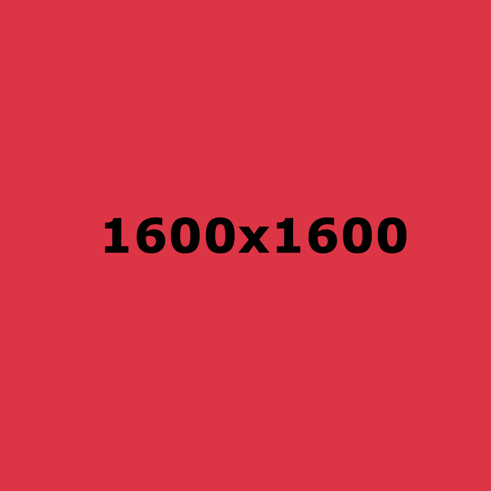

# Mis aficiones

En este blog os voy a hablar un poco de mis aficiones. Me sirven para desconectar, conocer gente y divertirme de tantas horas de programación en 
Django y JavaScript.

## Airsoft

En primer lugar os voy a hablar del **airsoft**. Un deporte poco conocido pero muy interesante. Se juegan partidas por equipos donde cada uno ira equipado con sus armas que disparan bolas de plástico. Normalmente se crean misiones para hacer mas dinámicas las partidas recreando misiones reales o inventadas.

Tu rol puede ser uno de los siguiente:

* Médico
* Radio
* Mecánico
* Sniper
* Apoyo
    * Primera linea
    * Segunda linea
* Artillero

Las equipaciones y réplicas se pueden comprar en páginas como:

* [Link Tienda VSGun](https://www.vsgun.com/)
* [Link Tienda Airsoft Yecla](https://airsoftyecla.es)

**Muy importante:** Es un hobby en el cual se tienen que llevar todas las replicas en regla ya que es motivo de sanción.

## Pesca

Otra afición a la que le dedico mucho tiempo es la **pesca**. Ya sea desde costa, embarcación o kayak. En especifico yo practico la captura y suelta de las especies que pesco. 

Es esta afición hay que tener mucha paciencia y no desanimarse ya que no siempre se vas a sacar las capturas que te gustaría.

### Pesca en kayak

Voy a hablar de este tipo de pesca ya que es la que mas me gusta. Ya que también es en la que mas ejercicio físico hago teniendo que remar millas y millas.

Este es mi kayak:

### Pescas 2022

|Mes |Cantidad|
| --- | --- |
|Enero|10|
|Febrero|3|
|Marzo|9|
|Abril|15|
|Mayo|8|

Es muy importante llevar todo el equipo básico para poder tener una buena y tranquila jornada de pesca.

 Este obra está bajo una <a rel="license" href="http://creativecommons.org/licenses/by-nc/4.0/">licencia de Creative Commons Reconocimiento-NoComercial 4.0 Internacional</a>.
